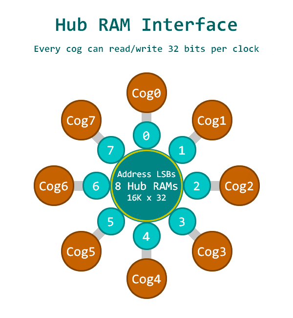

.. _p2_quickref:

Quick reference for the P2 (Propeller 2)
========================================

The team-oz P2 Reference Board

Below is a quick referece for Propeller 2 (P2) based boards.  P2 has unique features including smart peripherals built into every pin, there is an overview here

.. toctree::
   :maxdepth: 1
   
   general.rst
   tutorial/intro.rst
     
Installing MicroPython
----------------------

See the corresponding section of tutorial: :ref:'p2_intro' to flash your P2 board with native MicroPython firmware

General board control
---------------------

The MicroPython REPL uses a baudrate 115200.  Tab-completion is useful to find out what methods an object has.  Paste mode (control-E) is useful to paste a large slab of Python code into the REPL. 

The :mod:'machine' module:: 

    import machine

    machine.freq()          # get the current frequency of the CPU
    machine.freq(252000000) # set the CPU frequency to 252 MHz
    
The :mod:'p2' module::
    
    import p2
    
Basic Pins and GPIO
-------------------

See machine.Pin.

    from machine import Pin
    
    p_out = Pin(56, Pin.Out_PP)
    p_out.high()
    p_out.low()
    p_out.toggle()
    
    p_in = Pin(57, Pin.IN, Pin.PULL_UP)
    p_in.value() # get value, 0 or 1
    
Basic DAC (digital to analog conversion)
----------------------------------------

See machine.DAC.

    from machine import DAC
    dac = DAC(Pin(1))
    dac.write(77) # output approximately 1 volt using 123 ohm DAC
    

Smart Pins
==========

Every P2 can perform a wide variety of automated functions indepenently, such as ADC, PWM, UART

ADC (analog to digital conversion)
----------------------------------

See machine.ADC.

PWM (pulse width modulation)
----------------------------

See machine.PWM

UART (serial bus)
-----------------

See machine.debug

